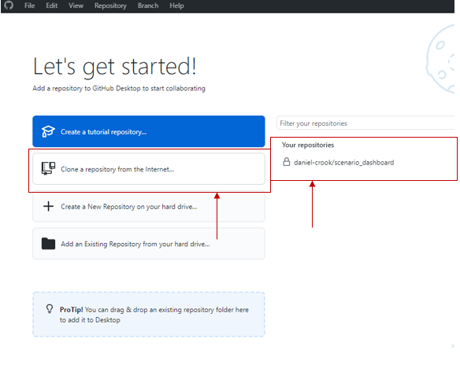
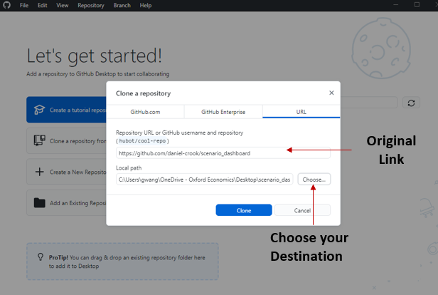
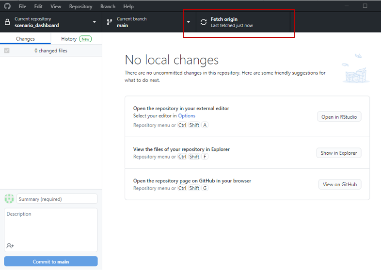
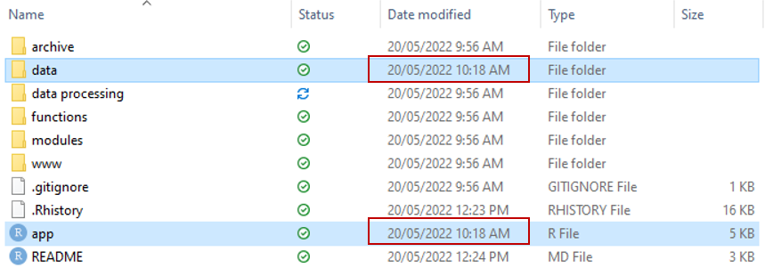
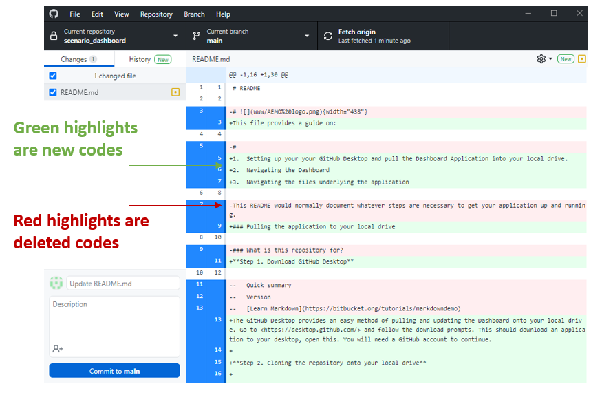
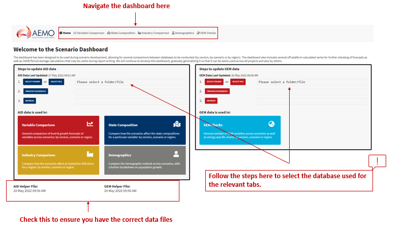
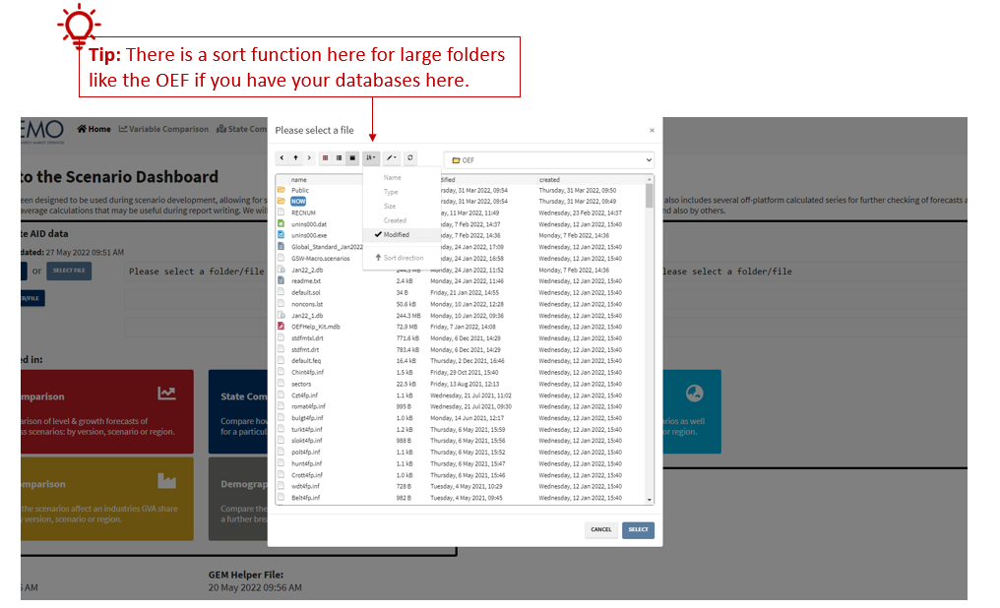
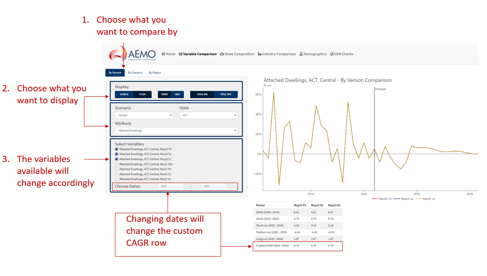

# README

This file provides a guide on:

1.  Setting up your your GitHub Desktop and pull the Dashboard Application into your local drive.
2.  Navigating the Dashboard
3.  Navigating the files underlying the application

### Pulling and updating the application to your local drive

**Step 1. Download GitHub Desktop**

The GitHub Desktop provides an easy method of pulling and updating the Dashboard onto your local drive. Go to <https://desktop.github.com/> and follow the download prompts. This should download an application to your desktop, open this. You will need a GitHub account to continue.

**Step 2. Cloning the repository onto your local drive**

Click on "*Clone a repository from the internet...*" to get the files from the GitHub onto your local drive. Alternatively you can click the right hand side filter and choose the Dashboard repository and follow the prompts.

If you do not have the Dashboard repository in your list of existing repositories, go to the *URL* tab and paste in the Dashboard link (<https://github.com/daniel-crook/scenario_dashboard>).

Next, set a location for the folder to be pulled to (destination). The image below shows an example of the folder being pulled into the Document folder in the local drive.

**Step 3. Ensuring the files are up to date**

Click on "*Fetch origin*" on the GitHub Desktop to ensure that you have the latest version of the Dashboard files. This will update your local folder with the most current files in GitHub.

You can see which files have been updated by looking at the *Date Modified* column in your file explorer. The example below shows that a recent *app* file was updated alongside the *data* folder.

You can also see what has been updated in the code on your GitHub Desktop. On the left panel, click on the "Changes" tab. Then click on the R files to see what has been added and removed since the previous version.

### Running and navigating the dashboard

**Step 1. Opening the Dashboard**

You will require R and R Studio to access the dashboard. Download the following and once downloaded, open the .exe files and follow the defauly installation prompts.

-   Install R: [https://cran.r-project.org/bin/windows/base](https://cran.r-project.org/bin/windows/base/)

-   Install R Studio: <https://cran.r-project.org/bin/windows/base/>

Open the "*scenario_dashboard*" folder in your local drive. Click and run the R file named "*app*". This should open up R Studio. Click anywhere on the script, then hold down "ctrl" + "shift" + "enter" on your keyboard to run the script.

This app.R script is the master file used to source the different 'modules' that are used to generate the dashboard. More details the dependencies are in the "More details" section.

**Step 2. Navigating the dashboard**

The dashboard will open in your default browsers. The homepage provides some additional information on the purpose for each tab and allow you to select your databases.

Select your databases depending on what dashboard you want to access. Make sure that the data helper file time stamps look correct once you have finished selecting your databases.

Once your databases have been selected, click on one of the tabs on top (e.g. *Variable Comparison*). Each tab follows a similar structure.

1.  On the left pane, you can select how you want to view the data. For example, in the Variable Comparison tab, you can view graphs and tables by version, by scenario, or by region.
2.  Then click on what you would like displayed. For example, levels versus year-on-year percentage change, and whether you want state level data or national level data. This will affect the drop-down options in the next section.
3.  Now you can choose what data you would like to view. Following the previous example, you can choose a series based on the Scenario, the State, and the Attribute.

Now you'll have a list of Variables that you can display as a chart and a CAGR table. Click on the Variables to toggle on/off the line chart on the graph and column in the CAGR table.

By default, the CAGR tables will have some set periods, but you can add a custom CAGR period in the Variable select section.

### More details

This section goes through the various underlying files used to run the 'app.R' file.

**Modules**

The modules folder contains the R files that app.R source from. These module files control each page and tab on the dashboard separately. For example, files with 'vc' in the prefix control the Variable Comparison page, and is also separated by the tabs 'region', 'scenario', and 'version', as these tabs are independent of each other within the Variable Comparison page.

Like any Shiny app, each modules have a UI and a Server component. The UI component allows for interactive features (such as buttons) and controls the overall aesthetics of the dashboard, while the Server component does the processing and calculations.

**Data**

The data folder contains R scripts used to import data that have been processed and converted to RDS files.

**Data Processing**

The data processing folder contains...

**Functions**

The functions folder contains various functions that were used to make the scripts more efficient.

### Contact

The dashboard was developed by Daniel Crook. Please contact [dcrook\@bisoxfordeconomics.com.au](mailto:dcrook@bisoxfordeconomics.com.au) if there are any questions or problems relating to the dashboard.
